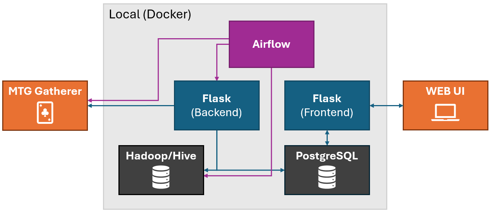
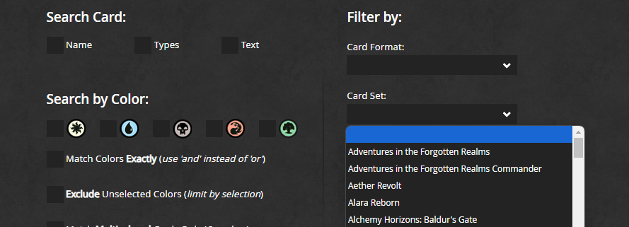
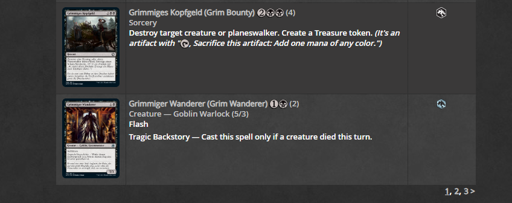
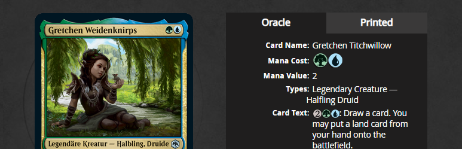
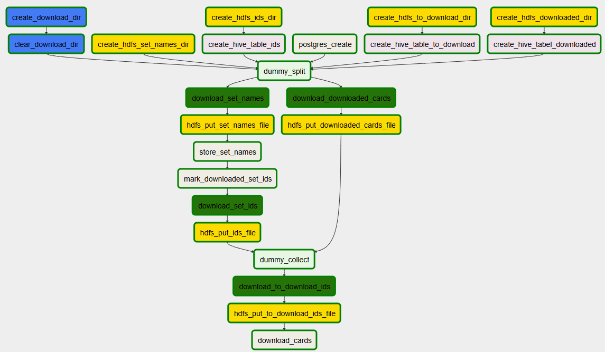
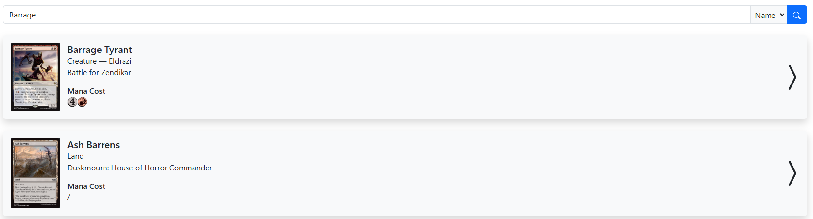
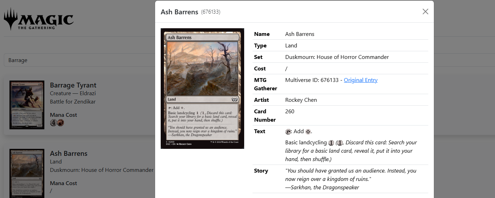

# Big Data MTG Crawler

- Tino Schaare (1299322) - [inf22001@lehre.dhbw-stuttgart.de](mailto:inf22001@lehre.dhbw-stuttgart.de)
- DHBW Stuttgart Informatik, Jahrgang 2022, Wahlfach Big Data
- For task and lecture reference, see: [GitHub Repo](https://github.com/marcelmittelstaedt/BigData/)

## Documentation

As presented in the image below, the whole project is composed of five docker container. Each has its own job:

- The **PostgreSQL container** container contains the end-user database.
- The **Flaks (Frontend) container** functions as a webserver for the web UI and provides a REST API to fetch data from the end-user database.
- The **Hadoop/Hive** container contains raw data that is donwloaded or provides in ETL process.
- The **Flask (Backend) container** exposes a REST API that serves differen purposes. The main task is to parse (donwloaded) HTML pages and extract their information. Additionally, some tasks interact with the end-user database and the Hadoop/Hive container.
- The **Airflow container** manages the whole ETL workflow and trigger actions regarding the Flask (Backend) container, the Hadoop/Hive container and own PySpark transformations.



Why use a seperate **Flask (Backend) container** event though the **Airflow container** runs Python as well?

- Airflow runs on the Python version 2.7., which is deprecated since January 2020. To still use up-to-date python packages, the **Flaks (Backend) container** is added, that runs on Python 3.12.

### ETL Explanation

The ETL workflow runs every 10 minutes. With every run, more cards are added to the end-user database which is accessable via the web UI. The whole process can be split into three steps:

1. Get a list of **set names**.
2. For each set name, get a **list of card IDs** that are in the set and add them to a backlog.
3. Continiously donwload cards from the card backlog.

#### (1) Set Names

At the main page of MTG gatherer, there is a dropdown with all set names. In this first, step this list is crawled and saved with a boolean value if the set is downloaded. This is done every run. If a new set name is added, it will be appended to the database.



#### (2) Card-ID list

With a set name, a MTG gatherer url can be build that leads to a table of cards that a in a given set. The problem is, that this table is paginated. Thus, this second step starts with the first page, download all card ids that are encoded in the link behind the card name, and then continous with the next page until the last page is reached. All these ids are stored.Afterwards, the corresponding set is marked as downloaded. This is done every run until all sets are marked as downloaded.



#### (3) Card download

Let $X$ be the set of all card IDs that are downloaded. And let $Y$ be the set of all card ids retrieved by step (2). $X$ and $Y$ are calcualted in every run before this step. Every run, a random subset $D$ of $x \in \mathbb{N}$ cards is taken:
$$
    D \subseteq Y \setminus X, \quad |D| = x
$$

Thus, $D$ is a set of cards that still have to be downloaded. All cards in $D$ are scraped and processed. Finnaly, their information is added to the PostgreSQL database.



### Aiflow DAG and Job/Transformations

Due to the educational purpose, different steps use different techniques, even though all could have been implemented using the same procedure.



Explenation of all Airflow DAG steps:

- **create_download_dir** and **clear_download_dir**: Creates an directory in the local airflow filesytem (not HDFS), where downloaded files can be stored before they are moved to their final destination.
- **create_hdfs_set_names_dir**: HDFS directory for storing a downloaded .html file. This file is later used to scrape a list of all available sets on MTG Gatherer.
- **create_hdfs_ids_dir** + **create_hive_table_ids**: Creation of HDFS directory with matching Hive table for .tsv files. This directory later hold a set of card ids and matching set names. This tables functions as a bacllog of scrapeable cards.
- **reate_hdfs_to_download_dir** + **create_hive_to_download_ids**: Creation of HDFS directory with matching Hive table for PySpark generated .csv files. This directory will later hold a set of "prepared cards" in each run that will be scraped shortly after.
- **create_hdfs_downloaded_dir** + **create_hive_downloaded_ids**: Creation of HDFS directory with matching Hive table for .csv files. This directory will later hold a set of card ids and matching set names that are already downloaded and in the end-user database.
- **postgres_create**: Creates the `ids` and `cards` tables in the end-user PostgreSQL database.
- **dummp_split**: Waits for the finish of all preperation tasks and splits the DAG into two parallel pathes.
- **download_donwloaded_cards** + **hdfs_put_downloaded_cards_files**: The task calls the `/api/downloaded-cards` enpoint. This will generate a CSV text with all cards that are present in the end-user database. The file is saved to the local airflow directory and put in HDFS afterwards, by the second operator.
- **download_set_names** + **hdfs_put_set_names_file**: Scapres the MTG Gatherer main pages and saves in two steps into the prepared HDFS directory.
- **store_set_names**: Calls the `/api/store-set-names` endpoint which retrieves the just scraped MTG Gatherer main pages via the Hadoop REST Api. This is then parsed with the Pyton Beautiful-Library. Therby, all set names are extracted. Therer are then stored to the end-user PostgreSQL database by appending only new elements. Each new element is enriched with a "downloaded" field which is set to `false` by insertion of a new element.
- **mark_downloaded_set_ids**: Calls the `/api/mark-stored-sets` endpoint. By using Hive with MapReduce, this will query a distinct set of set names, which card IDs are already added to the card backlog. Every set in this distinc list, will be marked as "donwloaded" in the end-user database. This will ensure that the same card IDs are not added twich to the card ID backlog.
- **download_set_ids** + **hdfs_put_ids_file**: Calls the `/api/get-set-ids` endpoint and stores the result. This will take a set name that is not dowloaded, scrape all its card IDs from the paginated MTG gatherer web pages and then returns them as a CSV text. This result will be saved as a .csv file and then moved to its HDFS directory.
- **dummy_collect**: This operator waits for the two strands to both finish.
- **pyspakr_prepare_download**: At this point, one Hive table contains a list of card IDs that are already in the end user datbase (mark_downloaded_set_ids operator), and another Hive table contains a list of all cards that are scrapeable. This PySpark transformation now substracts the list of already donwlaoded cards from the list of donwnloadable cards, and selects a certain number of cards of this difference. These selected cards are then stored to another Hive table. These are pepared to be downloaded next.
- **download_cards**: Calls the `/api/download_cards` endpoint. This will query the card IDs that were prepared for donwload by the PySpark transformation beforhand. Each card is scraped with all its detail from MTG Gatherer and added to the final card list in the end-user database.

### Frontend

The frontend is a single page web UI. The UI features a searching bar with a target selection. The target specifies, if the search is applied to the card name, card artist or card text.

After submitting the search, the provided information is send towards the `/api/search` endpoint. This queries the end-user database by using a similarity measure of two strings. A list with card information is returend, that is ordered by the similarity of the search target to the search query. This list is then displayed in the UI, wheras a similarity threshold prohibits really bad matches to be displayed.



Each visualized list item is clickable. This opens a modal that fetches detailed card information from the `/api/card` endpoint.



Two notes on the frontend implementation:

- The search information is attached to the URL, so that links contain the infromation of the search. Thus, active searches can be shared by sharing the link.
- Mana symbold are rendered into the text, displayed in the details. The text contains placeholders like `@Red@` that will be replaced by the matching image tag.

### Files

All files are present in this repository. When setting up the project, those are provided to the containers by mounting the directories.

- The used Aiflow DAG: `airflow/mtg_airflow.py`
- The PySpark transformation: `pyspark/pyspark_prepare_download.py`
- The DDLs for PostgresQL and HIVE: `ddl/*.sql`. Except for the `ddl/postgres_setup.sql` file, none of those files has to be executed manually.
- The Python files are in the `src` directory. Each Flask-Python container has a different entry point: `flaks-app.py` for the **Flask (backend) container** and `flaks_frontend` for the **Flask (frontend) container**.
- The files for the web UI are in the `static` folder, as they are served as static resources.
- Files for setting up the project are included in the `scrips` directory. For more setup instructions, see the setup section in this documentation.

## API Documentation

### Backend API

The **Flask (Backend) container** exposes an REST API with the following endpoints:

> `/api/test` \
> Tests the PostgrSQL and Hive connection.
>
> **Returns**
>
> - **200**: PostgreSQL and Hive version.
> - **400**: An error occured during the operation.

> `/api/postgres-create` \
> Creates all needed PostgreSQL tables if the don't exist.
>
> **Returns**
>
> - **200**: Queries for creating the tables were successful
> - **400**: An error occured during the operation.

> `/api/store-set-names` \
> Takes the downloaded .html and extracts a list of all set names.
> The list is stored to the PostgreSQL database. Existing elements
> are not overwritten. New elements will be appended
>
> **Returns**
>
> - **200**: Returns a string indicating the number of strings
> that were added to the PostgreSQL
> - **400**: An error occured during the operation.

> `/api/get-set-ids` \
> Gets a set name from the PostgreSQL that is marked as not downloaded.
> Then, it scrapes a list of all card ids from MTG Gatherer.
> These ids are then returned as a tsv.
>
> **Returns**
>
> - **200**: Returns a tsv list with all ids for a given set.
> - **400**: An error occured during the operation.

> `/api/mark-stored-sets` \
> Quries a distinc list of set names which card ids are scraped.
> For each set in this list, the corresponding PostgreSQL entry is also
> markd as downloaded.
>
> **Returns**
>
> - **200**: Returns a comma seperated list of all downloaded set names.
> - **400**: An error occured during the operation.

> `/api/download-cards` \
> Retrieves the list of cards that should be downloaded via Hive.
> Then downloads all cards, extracts the information and
> stores it to the PostgreSQL database.
>
> **Returns**
>
> - **200**: Returns a string indicating the number of scraped cards.
> - **400**: An error occured during the operation.

> `/api/downloaded-cards` \
> Gets a list of all cards that are donwloaded into the PostgreSQL
>
> **Returns**
>
> - **200**: CSV text of all card ids with its set name.
> - **400**: An error occured during the operation.

### Frontend API

The **Flask (Frontend) container** exposes an REST API with the following endpoints:

> `/api/search` \
> Given a search query, returns a list of matching cards.
>
> **Query Params**
>
> - **query**: string, search query
> - **count**: int, default=5, number of cards to be returned.
> - **target**: string, default=name, field to which the query string
> applied (name, text or artist)
>
> **Returns**
>
> - **200**: List of cards encoded as JSON.

> `/api/card` \
> Retrieves detailed information about a card.
>
> **Query Params**
>
> - **query**: int, id of the card
>
> **Returns**
>
> - **200**: Card information encided as JSON.

## Setup and startup

To **setup the project** for the first time, follow and execute the steps listed in `scripts/setup.sh`.

To **start the project** if it is already setup, follow and execute the steps listed in `scripts/startup.sh`.

To **reset the project**, just delte all docker containers and follow the setup instructions.

```bash
# Stop every running container
docker stop hadoop airflow python postgres frontend

# Remove all containers
docker rm hadoop airflow python postgres frontend

# Remove all images (optional)
docker rmi marcelmittelstaedt/spark_base:latest && docker rmi python:3.12.7-bookworm && docker rmi marcelmittelstaedt/airflow:latest && docker rmi postgres:latest
```

### Ports

If running the project, e.g. on a Google-Cloud VM, the following ports have to be exposed:

- 80 (443) for the Web-Frontend
